# Flex_FPGA_Matrix_Mul_8Bit
Dynamic_8Bit_Matrix_Multiplier_FPGA is a hardware-implemented matrix multiplier designed for rapid matrix calculations. Primarily used in machine learning applications like neural networks in self-driving cars, it improves performance and reduces CPU load by offloading computations to FPGA.

## Introduction

Machine learning is being used for many different applications these days. One such application is the self-driving car. One of the techniques used in self-driving cars is a neural network. With a neural network, the car can recognize traffic situations from camera images, for instance. This neural network involves many multiplications of nodes with a factor. These calculations can also be considered as matrix calculations. 

To ensure that self-driving cars can respond in time, it's important that the system is powerful enough to perform the calculations quickly. That's why a matrix multiplier has been implemented in hardware for this project. In this way, the matrix calculations can be performed by the hardware. This is not only faster than, for example, a CPU or GPU, but it also reduces the load on the CPU.

### Team

| Naam                 | LinkedIn                                                                |
| -------------------- | ----------------------------------------------------------------------- |
| Ruben Hiemstra       | [LinkedIn](https://www.linkedin.com/in/ruben-hiemstra-84b9b6127/)       |
| Stefan Beenen        | [LinkedIn](https://www.linkedin.com/in/stefanbeenen/?originalSubdomain=nl)                                                            |

## Elaboration

### General Solution
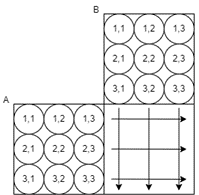</img>

To convert a matrix multiplier into VHDL, we first look at how the calculations are performed. The following will describe how this is done: 

A ∙ B = C

Here, the 1st row of matrix A and the 1st column of matrix B are multiplied and summed.
a_1.1 ∙ b_1.1 + a_1.2 ∙ b_2.1 + a_1.3 ∙ b_3.1 = c_1.1
The step above must be done for each element of the resulting matrix. Each intersection represents a point in the resulting matrix. This can also be seen as a vector calculation.

In the proposal, there is a component that performs the vector calculation. The proposed component diagram turned out to be incomplete because there is only one adder applied with three arguments in the diagram. In the 2nd version, it can be seen that an adder tree is used.

|submatrix vermenigvuldiger 1e versie       |submatrix vermenigvuldiger 2de versie      |
|-----------	                            |---	                                    |
| 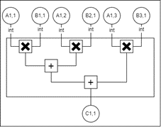</img>|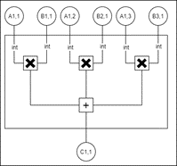</img> |  	

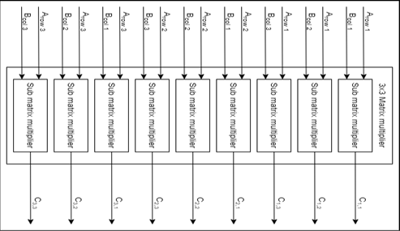</img>   

### Overflow and Underflow Detection
In case of an overflow or underflow in the vector calculation, the maximum or minimum 8-bit (signed) value is returned. To detect overflow/underflow during summations, the sign bit is observed. If the sign bit flips during the addition of two negative numbers, we know an underflow has occurred. If the sign bit flips with two positive numbers, this signifies an overflow. To determine whether an overflow or underflow has occurred in the multiplication, the result of the multiplications uses twice the number (16) of bits as the input signals. This result is then also added as 16-bit but is reduced back to 8 bits at the end.

### Register Avalon Interface
The interface chosen involves writing the matrices to the registers in memory. As a result, these matrices can be written directly as a C array to the registers and read from the registers. This makes it easy to control the matrix multiplier from C code. An Avalon interface has been implemented for the registers, enabling communication with the Avalon bus. For the registers, the Reg32 VHDL code from Intel has been used.

### Memory Layout
When implementing the matrix multiplier, it was discovered that memory is organized in little endian. In the design of the multiplier, we put the most significant bits at the front (left) in the bit string. To ensure that the bytes are loaded correctly, a component was created that swaps the signals per 8 bits in a 32-bit number. This component is used for both the input and output of the multiplier. This has no further impact on performance and does not produce extra hardware, but only ensures that the signals from the register to the matrix are reversed.

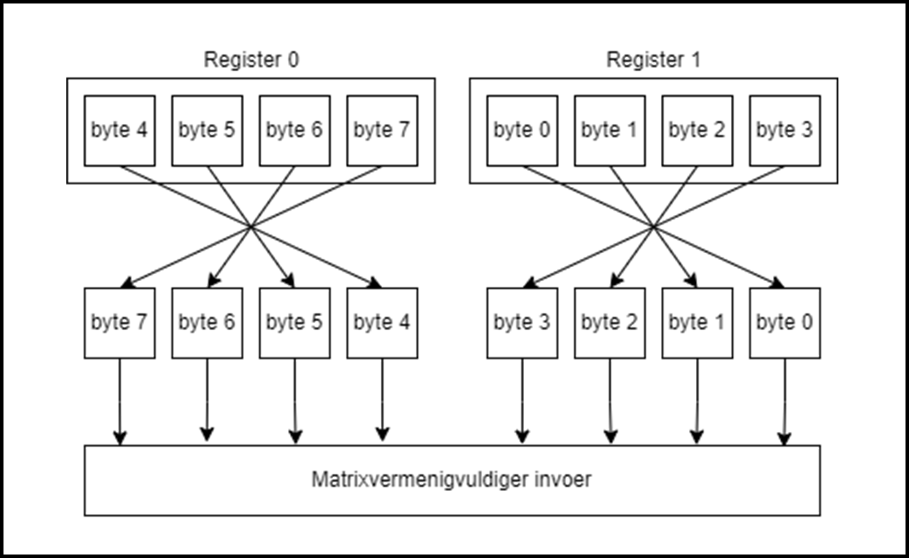</img>

### DSP Blocks
During synthesis, Quartus uses DSP blocks for multiplication of numbers. The number of DSP blocks required for a matrix is N3, where N is the size of an N by N matrix. For example, with a 4x4 matrix, the number of DSP blocks required is 4^3 = 64. This is because a vector calculation must be performed for all elements of the resulting matrix (4*4). With a 4x4 matrix, these vectors consist of 4 numbers that are multiplied with 4 other numbers. This means that 4 multipliers are needed for 4*4 elements, or 4^3 for a 4x4 matrix.

### Generics and Generate
Generics and generate statements in VHDL were used to set up the matrix multipliers. The entire design of the matrix multiplier is thus fully automatically generated based on the input values. The generics of the top-level can be adjusted in the Platform Designer. This makes it easy to change the size of the matrix multiplier without having to change the code.

</img>

### RTOS Softcore Implementation
The memory address of the matrix multiplier is set at 0x331000. Upon implementation, it appeared that address 0x21000, which stood directly behind the Nios in memory, did not work. Eclipse is then unable to download the C code to the Nios. After running the matrix multiplier on address 0x331000, which is far removed from the other components, the system worked. After the multiplier was moved to address 0x331000, the previous address 0x21000 was not empty. It seems that another component depends on this address, although the Platform Designer has released this address.

### Linux Implementation
To use the matrix multiplier with a Linux-based system, an HPS system has been implemented in the FPGA that can communicate with the hardcore on the board. For the task, it was proposed to add an interrupt pin to
the matrix multiplier. This would allow the component to interrupt the HPS when it is finished with the calculation. Thus, the Linux system, for example, does not have to constantly check whether the matrix multiplier has finished its calculation. Testing the implementation with Linux revealed that the result can be read directly after the inputs are set in the registers. Therefore, for matrices of 4 by 4 or smaller, it is not advantageous to add an interrupt.

## Testing & Results
The Intel FPGA used here contains a total of 87 DSP blocks. This presents a problem for matrices larger than 4 by 4. For instance, 125 DSP blocks are needed for a 5 by 5 matrix. Therefore, the maximum size of the matrix to be tested will be 4 by 4.

In the proposal, a test would be performed with a Performance Counter to compare the speed between the software and hardware implementations. To test the speed of the implementations, a Performance Counter has been added as a component to the hardware. 
For testing the software implementation, a performance counter was used that is started before the multiplyMatrices function is called and is terminated when the function returns. The hardware implementation was harder to test as it was ready immediately. This was tested by directly reading one byte from the result after one byte in the input had been changed. The value of this byte matched expectations.
To measure the practical speed of the hardware component, the loading of two 4x4 matrices with memcpy was measured. 
Additionally, the timing analyses of Quartus were consulted to find out how long a calculation would take. Unfortunately, this did not yield any information about the speed of the matrix multiplier.
To measure the speed of the C matrix multiplier, the Performance Counter was put around the multiplyMatrices function. It was found that it takes 0.00079.


#### **VHDL Matrixvermenigvuldiger**
``` C
PERF_BEGIN(PERFORMANCE_COUNTER_0_BASE, 1);

memcpy(
    (int8_t*)MATRIXMULTIPLIER_8BIT_COMPONENT_0_BASE ,
    matA, 
    sizeof(matA)
    );

memcpy(
    (int8_t*)MATRIXMULTIPLIER_8BIT_COMPONENT_0_BASE+16,
    matB, 
    sizeof(matB));

PERF_END(PERFORMANCE_COUNTER_0_BASE, 1);

```
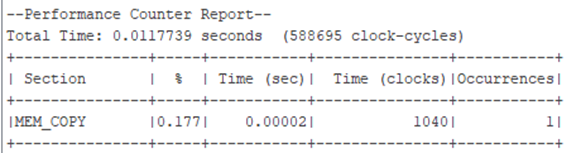</img>

#### **C Matrixvermenigvuldiger**
```C
    void multiplyMatrices(int8_t matA[][SIZE_N], int8_t matB[][SIZE_N], int8_t result[][SIZE_N], int r1, int c1, int r2, int c2) {
        for (int r = 0; r < r1; ++r) {
            for (int c = 0; c < c2; ++c) {
                result[r][c] = 0;
                for (int k = 0; k < c1; ++k) {
                    result[r][c] += matA[r][k] * matB[k][c];
                }
            }
        }
    }
```

```C
    PERF_BEGIN(PERFORMANCE_COUNTER_0_BASE, 1);

    multiplyMatrices(matA, matB, matC, SIZE_N, SIZE_N, SIZE_N, SIZE_N);

    PERF_END(PERFORMANCE_COUNTER_0_BASE, 1);
```
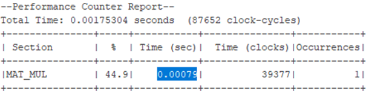</img>


#### Over- and Underflow Detection
Below are the various calculations of the matrix multiplier, both from C and VHDL, and online (external).

##### **Input**

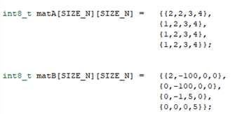</img>

##### **Check**
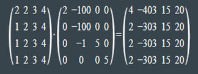</img>

##### **Output**

###### The results of the VHDL implementation

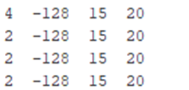</img>

###### The results of the C implementation  

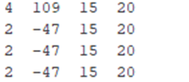</img>


## Conclusion & Discussion
The results indicate that the hardware matrix multiplier operates correctly. Significant performance gains in execution time can be achieved by implementing the matrix multiplication in hardware compared to software (on the Nios processor). In this system, the matrix calculations of a 4x4 matrix are so quick that they can be used in the Nios at the next clock cycle. The Nios runs at 50MHz, which means the hardware multiplier for a 4x4 matrix is executed in under 20 nanoseconds.

Despite the significant improvement in execution time, this comes at the expense of development time and the amount of required hardware. Developing the matrix multiplier took over 56 hours, while the implementation of the matrix multiplication in C was completed within an hour. The number of transistors required for a larger matrix also increases exponentially.

To save hardware space without sacrificing too much speed, the design of the multiplier can still be optimized. By performing multiple multiplications in a pipeline, the number of hardware multipliers can be reduced.


## Quartus

### RTOS
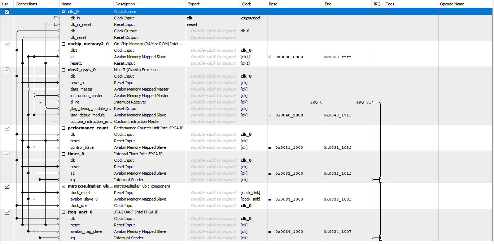</img>

### HPS
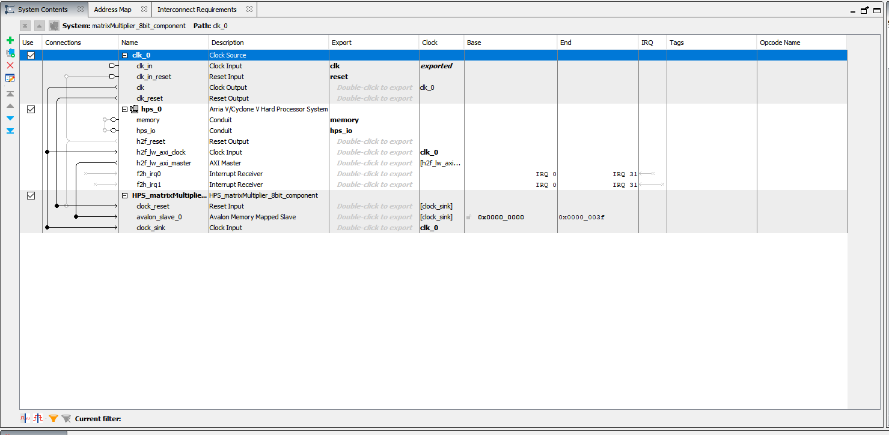</img>
